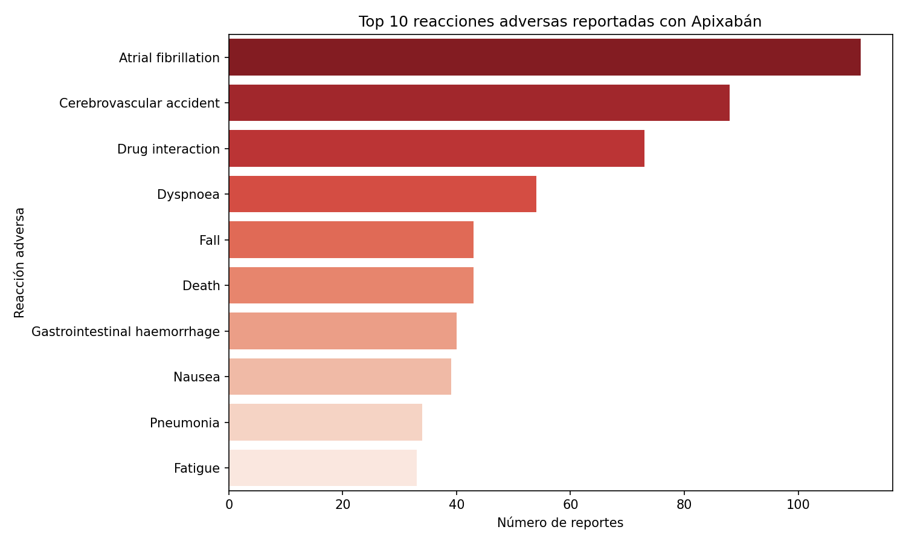
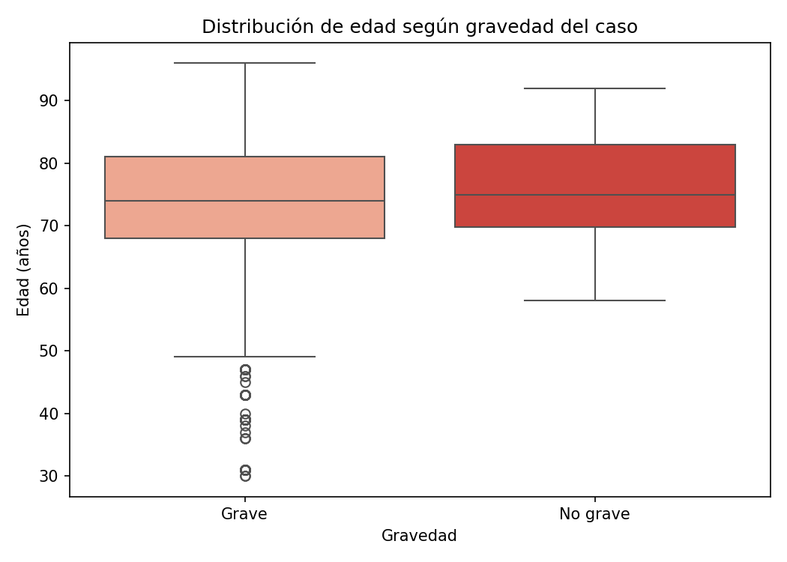

# Detección de señales de farmacovigilancia — Apixabán (openFDA/FAERS)

## Problema
Los sistemas de reporte espontáneo de eventos adversos (como FAERS de la FDA) son una fuente clave de farmacovigilancia post-comercialización. Este proyecto analiza reportes reales de apixabán (anticoagulante oral) para identificar las reacciones adversas más frecuentes y evaluar si la edad del paciente se asocia con la gravedad del caso.

## Dataset
Datos extraídos vía API de openFDA (FAERS). Universo total: 67,478 reportes de apixabán; muestra analizada: 1,000 reportes (3,185 registros de reacción, ya que un reporte puede incluir varias reacciones).

## Metodología
- Extracción de datos vía API REST de openFDA (`requests`).
- Limpieza y normalización: mapeo de códigos (sexo, gravedad), filtrado de edad por unidad reportada (se excluyeron edades no registradas en años).
- Análisis exploratorio: frecuencia de reacciones adversas reportadas.
- Prueba de hipótesis (Mann-Whitney) comparando la edad entre casos graves y no graves.

## Herramientas
`Python` `Pandas` `Requests` `SciPy (Mann-Whitney)` `Matplotlib` `Seaborn`

## Hallazgos

**Top reacciones adversas reportadas:** fibrilación auricular, accidente cerebrovascular, interacción medicamentosa, disnea, caídas, muerte y hemorragia gastrointestinal, entre otras. *Nota clínica:* la fibrilación auricular no representa necesariamente un efecto adverso, sino la indicación de tratamiento más común de apixabán — un fenómeno conocido en farmacovigilancia como "confusión por indicación", frecuente en bases de reportes espontáneos.

**Edad y gravedad del caso:** los casos graves (n=2,354) mostraron una edad promedio de 72.6 años, frente a 76.1 años en los no graves (n=92) — diferencia estadísticamente significativa (Mann-Whitney, p=0.043). El resultado, aunque significativo, debe interpretarse con cautela dado el fuerte desbalance muestral entre grupos, característico del sesgo de notificación de los sistemas de reporte espontáneo (los casos graves se reportan con mucha mayor frecuencia que los leves).

## Conclusiones
El análisis confirma señales de seguridad ya conocidas para apixabán (sangrado, eventos cerebrovasculares) y evidencia las limitaciones inherentes a los datos de FAERS (sesgo de notificación, ausencia de un grupo comparador no expuesto). Se recomienda complementar este tipo de análisis con estudios de cohorte para confirmar causalidad.

## Notebook
El análisis completo está en [`farmacovigilancia_apixaban.ipynb`](./farmacovigilancia_apixaban.ipynb).

---
*Proyecto desarrollado por [Sara Camacho E.](https://www.linkedin.com/in/sara-camacho-es/) — [portafolio completo](https://sara-mst.github.io/)*
